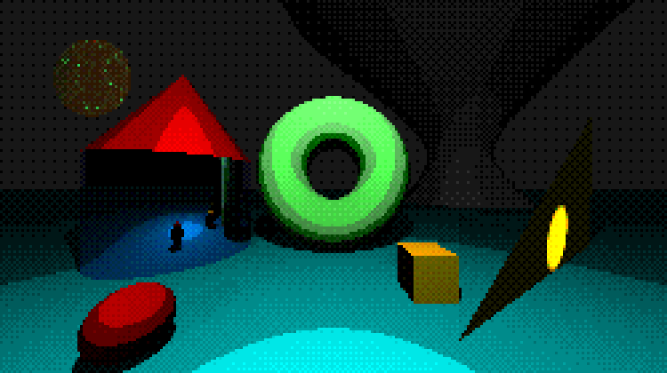
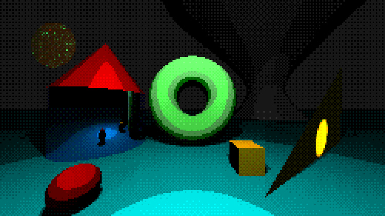

# PixelRay: simple ray tracer for pixel/retro-themed scenes and animations

<p align="center">
  <br>
  <em>Static base scene</em>
</p>

<p align="center">
  <br>
  <em>Animation from base scene</em>
</p>

> More static demo images can be found [here](docs/Images/Demo/)

## Table of contents

- [<u>Pixel-look</u>](#pixel-look)
- [<u>How to use</u>](#how-to-use)
- [<u>Scene</u>](#scene)
    - [<u>Scripting</u>](#scripting)
- [<u>Building from source</u>](#building-from-source)
- [<u>Running tests</u>](#running-tests)
- [<u>Future additions</u>](#future-additions)

## Pixel-look

PixelRay supports following tools for achieving pixel-themed look:

- low resolutions + nearest-neighbor upscaling for higher resolutions
- lighting quantization
- hard shadows + simple soft shadow logic with fixed disc offsets instead of sampling. Adjustable light radius and
 shadow quantization bands
    - soft shadows can look quite rough and out of place if light radius is even slightly larger, especially in 
    animations
- ordered dithering
- keep reflection bounces low
    - reflections + enough lighting are good for local use
    - global illumination is not really possible as each ray follows just a single path. So even with high bounces and 
    lot of reflective surfaces the end outcome is probably not that good. Of course this can still create interesting 
    visuals
    - diffused lighting can be used for additional dithering/flickering in animations
- custom color palettes
    - not required, but can certainly change the aesthetics a lot

=> no anti-aliasing, resampling or realistic lighting (global illumination). Focus is on aliasing the initial output
 to achieve a stylistic look

## How to use

- Executables for 64-bit Windows and Linux-x64 can be found in [Releases](https://github.com/j-miet/PixelRay/releases)
- Otherwise you need to [build from source](#building-from-source)

To produce an output image, paths for scene and output files are required:

```bash
./PixelRay -i <inputPath> -o <outputPath>
```

If you want to automatically open the output after rendering, add the `-p`/`--preview` flag. This will attempt to 
call default image opener program via shell execution:

```bash
./PixelRay -i scene.json -o output.png -p
```

For scripting e.g. animations, input static scene and Lua script files. This can be do 
with `-s`/`--script` flag:

```bash
./PixelRay -i <inputPut> -s <scriptFile> <frames> {-g}
```

Here `frames` is the total amount of frames + optional `-g`/`--gif` to produce a GIF from produced frames. For example

```bash
./PixelRay -i scene.json -s script.lua 60 -g
```

To avoid file path issues, just keep scene and script file in the same directory with executable.

#### All commands

- `-i <path>` or `--image <path>`

    Scene file path. Scenes are stored in **json** files (see Scenes section below).

- `-o <path>` or `--output <path>` 

    Output file path. Image format is either **.png** or **.ppm**.
- `-p` or `--preview`:

    Attempts to open the output image after rendering by executing the image file, thus calling the default viewing 
    tool in process. Only available for png images as basic editors seldom support ppm.

- `-s <luaScript> <frameCount> {gif}` or `--script <luaScript> <frameCount> {gif}`

    Uses the static scene from `-i` command as a baseline then runs Lua script to produce output frames into 
    `./frames` directory. Output format is always **png**, frame count defaults to 60 if frameCount is not a valid 
    integer value.
    - script file uses Lua language and must there end in .lua
    - cannot be used with output or preview flags
    - automatically flushes `frames` directory to remove old images
    - can optionally pass `-g` / `--gif` flag to produce a GIF file from saved frames.

    Example:
    
    ```bash
    PixelRay -i scene.json -s script.lua 30 -g
    ```

    produces files frame0.png to frame29.png in `./frames` and 
    then combines these into a gif file as `outputGif.gif`

- `--debug <mode>`
    
    Renders image based on selected debug mode. These are:
    - `normals` = color objects based on normal directions. Red = x, Green = y, Blue = z
    - `distance` = color objects based on how far they're from camera. Uses gray scale: closer objects are white/light 
    gray and distant objects become darker. Missed rays produce red pixels.
    - `id` = each object gets a random color

    Modes cannot be mixed, only first one gets applied.


## Scene

> Scene file and animation script templates can be found in [here](scene-template).

Scenes use **json** format.

For all scene parameters and their explanations, see [Scene.md](docs/Scene.md)

### Scripting

Scripts use Lua programming language embedded into C# 
via [MoonSharp](https://github.com/moonsharp-devs/moonsharp) interpreter

Scripting can be applied to

- object transforms (translation/positioning, scaling, rotations)
- camera (position, forward/upward direction, fov, aspect ratio)

For scripting API, see [Lua.md](docs/Lua.md)

## Building from source

Both third-party packages
- [SixLabors.ImageSharp](https://github.com/SixLabors/ImageSharp) (png and gif generation)
- [MoonSharp](https://github.com/moonsharp-devs/moonsharp) (Lua scripting)

are be well-supported on Windows, Linux and macOS.

---

To build the executable:

1.  you need to install [.NET SDK](https://learn.microsoft.com/en-us/dotnet/core/install/linux). PixelRay uses 
version 10.0.

2. change working directory to project source i.e. the directory where **Pixelray.csproj** file is located.

3. Build with `dotnet publish -c Release -r <rid> <args>`

---

There are generally two ways to build project:

1. Self-contained executable
    - larger size (almost 40 MB) but runs on its own, no .NET runtime installation 
    required from end user
2. minimal executable file + DLLs 
    - very small, but end user must have **.NET 10.0 Runtime** installed

Instead of modifying *PixelRay.csproj* for each, both can be done by passing additional args to build command.

- for args specification check 
[this](https://learn.microsoft.com/en-us/dotnet/core/deploying/single-file/overview?tabs=cli)
- examples below use 64-bit Windows as runtime identifier; for other RIDs, see 
[this](https://learn.microsoft.com/en-us/dotnet/core/rid-catalog#known-rids)

#### Powershell

1. Self-contained:
    ```powershell
    dotnet publish -c Release -r win-x64 --self-contained true -p:PublishSingleFile=true -p:EnableCompressionInSingleFile=true
    ```

2. minimal, but requires .NET runtime
    ```powershell
    dotnet publish -c Release -r win-x64 --self-contained false
    ```

#### Bash

No differences here, same commands work:

1. Self-contained
    ```bash
    dotnet publish -c Release -r win-x64 \
      --self-contained true \
      -p:PublishSingleFile=true \
      -p:EnableCompressionInSingleFile=true
    ```

2. minimal, but requires .NET runtime
    ```bash
    dotnet publish -c Release -r win-x64 \
      --self-contained false
    ```

#### Output

Release build can be found in "PixelRay/bin/Release/net10.0/win-x64/publish" or similar depending on which RID was 
used e.g. linux-x64 instead of win-x64


## Running tests

[.NET SDK](https://learn.microsoft.com/en-us/dotnet/core/install/linux) version 10.0 is required.

[xUnit](https://xunit.net/docs/getting-started/v3/getting-started) is used for testing. You don't need to download 
this manually, tests.csproj includes all dependencies which will be downloaded when test command is run.

**To run tests:** cd into "PixelRay/tests" then use command `dotnet test`


## Future additions

The goal of this project is not to become become a large, heavily optimized ray/path tracing tool yet it should 
still have a good amount of customization options. So here's a short list of what most likely gets added:

- build-in color palettes + read palettes from files 
    - this way scene.json palette field would only require the file path instead of listing all the colors
- depth of field/blur in some form
- materials/mediums: glass, matte, fog/gas etc.
    - maybe simple emissive materials although current lighting is already good enough
- geometry:
    - triangle meshes for custom shapes
    - maybe some new primitives
- shared materials (and meshes): current system adds materials inside each object, preventing reusing them
- performance 
    - at least BVH when meshes get added
        - so far only torus primitive uses something similar with a lazy bouncing sphere logic
    - otherwise some smaller optimizations here and there
- more tests

#### Priority
1. meshes + BVH
2. new materials/mediums
3. the rest