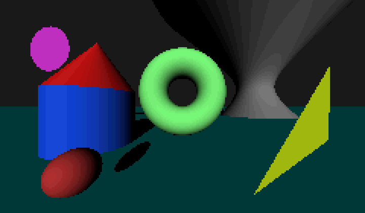

# PixelRay: A pixel-styled ray tracer

| |
|:--:|
| *Demonstration of different object primitives (hard shadows, directional lighting)* |

### Features

- primitives:
    - Sphere
    - Disc
    - Plane
    - Triangle
    - Cylinder
    - Cone
    - Torus
    - Quadric (general class)
    - AABox (axis-aligned box)

- affine transforms via 4x4 matrices
    - rotation
    - transforms/shifting
    - scaling (both uniform and non-uniform)

- lighting
    - directional light

- camera
    - camera origin/eye point
    - width
    - height
    - viewport height
    - focal length (= distance to viewport)

- rendering
    - width
    - height
    - color palette
    - lighting bands
    - ambient color factor
    - rendering config
        - image upscale factor
        - debug mode

### Pixel-look

To enforce pixelated look:

- low resolutions, use upscaling for high res (nearest-neighbor)
    - alternate: high res render into downsampling
- no anti-aliasing, one pixel per ray
- lighting quantization (no smooth shading, stark contrast levels -> black, a few shades of gray -> white)
- limited color palettes (e.g. 16 or 32 colors, also custom palettes supported)
- general quantization: limit directional vectors by snapping them to ranges
    - reflection angles
    - camera direction
    - normals (e.g. snap to axis direction would be only 6 directions)

### TODO

- reflections (1 bounce enough for start)
- ambient lighting
- soft shadows
- add material interface + one example
- Box (axis-aligned) primitive
- read input from Yaml file to create scene
- rotating camera direction (= scene stays same, but rerender from different angle)
