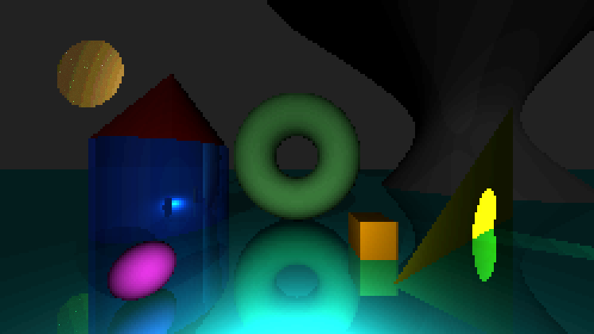

# PixelRay is a pixel-styled cross-compatible ray tracer


## Table of contents

- [<u>CLI</u>](#cli)
- [<u>Scenes</u>](#scenes)
    - [<u>Rendering</u>](#rendering)
    - [<u>Objects</u>](#objects)
    - [<u>Materials</u>](#materials)
    - [<u>Lights</u>](#lights)
- [<u>Building from source</u>](#building-from-source)


## CLI

Every command requires at least two things: scene file path + either

- output file path

    ```bash
    PixelRay -i <inputPath> -o <outputPath>
    ```

    or

- preview flag:

    ```bash
    PixelRay -i <inputPath> -p <previewDelay>
    ```

Output = store image in .png or .ppm format  
Preview = display image in a new window, loading it gradually (higher values add delay, 0 = loads as quickly as possible) then flushing data after window is closed

Previewing can be of course done while still producing an output:

```bash
PixelRay -i scene.json -o output.png -p 0
```

#### All commands

- `-i <path>` scene file path. Scenes are stored in **json** files (see Scenes section below)
    - alternative: `--image <path>`
- `-o <path>`: output file path. Image format is either "png" or "ppm"
    - alternative: `--output <path>`
- `-p <delay>`: produce a preview image with SILK.NET library. Delay displays image gradually, loading pixels left to right, row by row. 0 = no delay.
    - alternative: `--preview <delay>`
- `--debug <mode>`: applies a debug mode to output/preview. Has following modes:
    - `normals` = color objects based on normal directions. Red = x, Green = y, Blue = z
    - `distance` = color objects based on how far they're from camera. Uses gray scale: closer objects are white/light gray and distant objects become darker. Missed rays are red dots.
    - `id` = each object gets random color


## Scenes

Scenes use **json** format.
Default scene file can be found [here](docs/scene.json).

### Rendering

#### camera
- origin/eye point
- lookAt direction
- up axis (useful for rotating)
- field of view

#### render

- threading (for rendering, disabled by default)
- width
- height
- upscaling factor
- color palette (default is no palette)
- lighting bands (quantization)
- light ray bounces
- dithering (ordered)
- dithering quantization levels
- dithering dimension (Bayer matrix: either 4 or 8)


### Objects

#### primitives:
- Sphere
- Disc
- Plane
- Triangle
- Cylinder
- Cone
- Torus
- Quadric (general equation)
- AABox (axis-aligned box, cannot be rotated)

#### transforms
- rotation 
    - 4D vector [x, y, z, w] where (x,y,z) is the rotation axis and w the angle (in degrees)
- position (e.g. translation/shifting)
- scaling (both uniform and non-uniform)


### Materials
- surface (general material with reflection and roughness controls)
- mirror


### Lighting
- ambient
- directional
- point (emits radially)
- spot (spotlight, angle defined in degrees)

#### shadows
- hard shadows
- very simple soft shadows (no sampling)


## Pixel-look

To enforce pixelated look:

- low resolutions only, use nearest-neighbor upscaling for higher res
- no anti-aliasing/resampling, only one ray per pixel
- lighting quantization
- keep reflection bounces low (1-3 is good) + bounce to a single direction (projected or sampled)
- ordered dithering
- hard shadows + simple soft shadows
- custom color palettes

## Building from source

Code should be cross-platform compatible: both third-party packages
- SILK.NET (for quick image previewing)
- ImageSharp (for .png output format)

are also supported on Linux and macOs.

---

To build the executable, use

> dotnet publish -c Release -r \<os\> \<args\>

For example Windows 64-bit would be

`dotnet publish -c Release -r win-x64 <args>`

There are generally two ways to build into an executable:
1. Self-contained exe with glfw3.dll. This dll is SILK.NET native dependency and needs be included
    - large exe (~37 MB) but runs on its own, no .NET runtime required
2. minimal exe + DLLs 
    - very small, but **requires .NET 10.0 Runtime** which can be downloaded 
    [here](https://dotnet.microsoft.com/en-us/download)

Instead of modifying *PixelRay.csproj* for each, both can be done by passing additional args.

- for args specification check [this](https://learn.microsoft.com/en-us/dotnet/core/deploying/single-file/overview?tabs=cli)
- examples below use Windows as runtime; for other identifiers, see [this](https://learn.microsoft.com/en-us/dotnet/core/rid-catalog#known-rids).

#### Powershell

1. Self-contained:
    ```powershell
    dotnet publish -c Release -r win-x64 --self-contained true -p:PublishSingleFile=true -p:EnableCompressionInSingleFile=true
    ```

2. minimal, but requires .NET runtime
    ```powershell
    dotnet publish -c Release -r win-x64 --self-contained false
    ```

#### Bash

1. Self-contained
    ```bash
    dotnet publish -c Release -r win-x64 \
      --self-contained true \
      -p:PublishSingleFile=true \
      -p:EnableCompressionInSingleFile=true
    ```

2. minimal, but requires .NET
    ```bash
    dotnet publish -c Release -r win-x64 \
      --self-contained true \
      -p:PublishSingleFile=true \
      -p:EnableCompressionInSingleFile=true
    ```

Release build can be found in "bin/Release/net10.0/win-x64/publish" or similar.